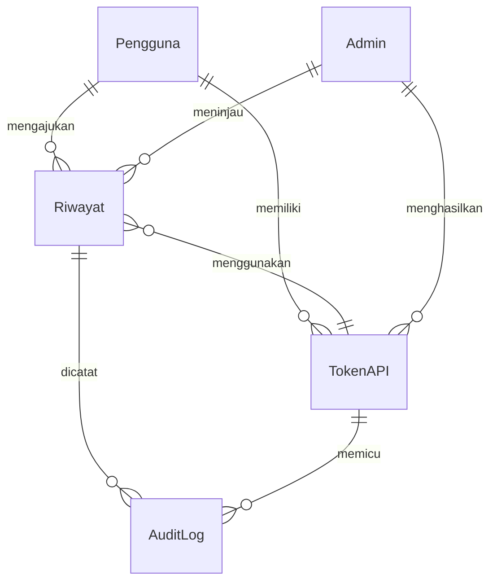
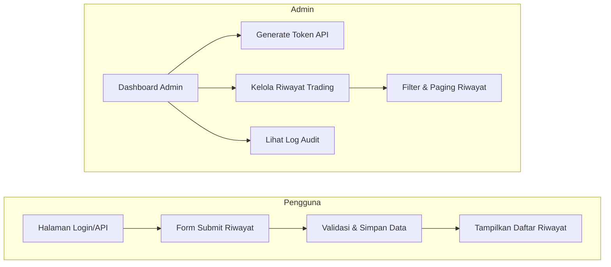

# Ringkasan Eksekutif  
Dokumen ini merinci kebutuhan dan desain untuk aplikasi web **Trading History** dengan dashboard admin. Aplikasi ini memungkinkan pengguna (submitter/viewer) mengelola dan melihat riwayat trading, serta admin untuk menghasilkan token API, mengelola pengiriman data, dan melihat audit log. UI dirancang mengikuti estetika Airbnb (skema warna, tipografi, dan komponen serupa)【48†L37-L43】【49†L79-L84】. Pembangunan meliputi definisi user persona, cerita pengguna, spesifikasi UI (gaya visual, komponen), desain wireframe halaman, desain API (token, otentikasi, pengambilan data, paging/filter), model data (riwayat dan token), pertimbangan keamanan/privasi, rencana pengujian, dan roadmap implementasi.  

## Pengguna Sasaran & Personas  
- **Trader individu** (misal: *Andi*): Memerlukan cara cepat untuk mengarsip dan meninjau riwayat trading. Suka antarmuka bersih dan intuitif. Misalnya Andi, trader saham retail yang ingin melihat ringkasan harian dan menyaring riwayat berdasarkan tanggal atau saham.  
- **Investor bisnis** (misal: *Budi*): Mengelola sejumlah akun atau portofolio. Perlu fitur otentikasi dan audit untuk kontrol lebih ketat. Misalnya Budi, manajer aset yang membutuhkan token API untuk mengakses data trading timnya.  
- **Admin/Compliance Officer** (misal: *Citra*): Internal IT/security. Tugasnya menghasilkan token API, memonitor pengiriman data, dan meninjau log aktivitas. Membutuhkan dashboard yang menampilkan status token, daftar riwayat yang dikumpulkan, dan audit log keamanan.  

## Cerita Pengguna & Kriteria Penerimaan  
- **Sebagai pengguna**, saya ingin mendaftarkan token API sehingga saya dapat mengotentikasi diri.  
  - *Kriteria:* Form input token berhasil divalidasi; muncul pesan sukses. Jika gagal, tampilkan notifikasi kesalahan.  
- **Sebagai pengguna**, saya ingin mengirim data riwayat trading (misalnya CSV atau form) sehingga tercatat dalam sistem.  
  - *Kriteria:* Setelah submit, data tersimpan; pengguna melihat konfirmasi. Jika data tidak valid, muncul error.  
- **Sebagai pengguna**, saya ingin melihat daftar riwayat trading saya dengan paginasi dan filter (tanggal/jenis transaksi) sehingga mudah menganalisis history.  
  - *Kriteria:* Tabel riwayat menampilkan data sesuai filter; tombol paging berfungsi; error jika query gagal.  
- **Sebagai admin**, saya ingin menghasilkan token API baru sehingga pengguna dapat mengakses sistem.  
  - *Kriteria:* Setelah klik “Generate Token”, token dibuat dan ditampilkan. Jika pembuatan gagal, admin diberi pesan error.  
- **Sebagai admin**, saya ingin melihat dan menghapus entri riwayat yang masuk untuk moderasi (misalnya data tidak valid).  
  - *Kriteria:* Admin dapat menyaring riwayat, melihat detail tiap entri, dan menghapus entri tertentu. Konfirmasi ditampilkan setelah tindakan.  
- **Sebagai admin**, saya ingin melihat audit log semua aktivitas (token dibuat/dihapus, data disubmit) untuk keperluan keamanan dan kepatuhan.  
  - *Kriteria:* Audit log menampilkan entri timestamp, actor (user/admin), aksi, dan status. Data log lengkap dan tidak dapat diubah.  

## Panduan Gaya UI (Airbnb)  
Aplikasi ini mengikuti panduan gaya visual Airbnb.co.id:  

- **Warna Utama:** *Rausch* – coral (#FF5A5F). Digunakan pada tombol utama (CTA) dan elemen aksen.  
- **Warna Sekunder:** *Babu* – hijau toska (#00A699) untuk status sukses/konfirmasi.  
- **Warna Teks:** Abu gelap `rgb(72,72,72)` (≈#484848) untuk teks utama【48†L37-L43】【49†L79-L84】. Misalnya paragraf isi, label form. Latar belakang putih (#FFFFFF) 【48†L37-L43】【49†L79-L84】.  
- **Warna Pelengkap:** Abu netral (#767676) untuk teks sekunder (placeholder, deskripsi), abu muda (#F7F7F7) untuk background input atau tabel stripe, dan #717171 untuk teks ikon/small.  
- **Tipografi:** Font *Circular* (Airbnb custom) dengan fallback `-apple-system, BlinkMacSystemFont, Roboto, "Helvetica Neue", sans-serif`【48†L37-L43】【49†L79-L84】. Ukuran teks normal 14px (lihat style paragraf)【48†L37-L43】【49†L79-L84】. Teks isi (paragraf utama) menggunakan 16px【48†L60-L64】【49†L109-L112】. Judul/page heading menggunakan font-weight lebih tebal (bold) dan ukuran lebih besar (misalnya 24–32px) sesuai hirarki.  
- **Spasi/Layout:** Grid berbasis 8px. Contohnya margin atas 16px pada blok konten【49†L79-L84】, padding 8px antar elemen kecil. Jarak antar seksi (section) 16–24px (lihat kode margin-bottom:24px【48†L80-L85】).  
- **Komponen UI:**  
  - **Tombol (Buttons):** Bentuk sudut membulat (border-radius≈4px), latar coral #FF5A5F, teks putih, hover gelap (koral gelap). Tombol sekunder border solid coral transparan dengan teks coral.  
  - **Form/Field:** Label teks abu #484848, field input putih dengan border 1px solid #DDDDDD, fokus border #00A699, radius 4px. Teks placeholder berwarna abu #767676.  
  - **Tabel & Daftar:** Header tabel menggunakan latar #FFFFFF dengan teks abu #484848. Baris bergantian bisa diberi hover latar #F7F7F7. Grid border tipis #E0E0E0. Tombol aksi dalam tabel (edit/hapus) berikon, menggunakan warna aksen (mis. merah untuk hapus).  
  - **Notifikasi/Alert:** Latar hijau #00A699 untuk sukses, kuning #FFD369 untuk peringatan, merah #FC642D (Arches) untuk error, sesuai palet Airbnb.  
Referensi gaya di atas berdasarkan analisis HTML/CSS Airbnb.co.id【48†L37-L43】【49†L79-L84】 serta komponen visual mereka (layar login, listing, dashboard). 

## Deskripsi Wireframe Halaman  
**Situs Publik (User Portal):**  
- *Login/API Key Page:* Form input token/API key. Tombol “Masuk/Lanjutkan” bergaya coral. Link bantuan.  
- *Halaman Submit Riwayat:* Judul halaman, form (input tanggal, instrumen, jumlah, harga, jenis beli/jual). Tombol submit coral. Pesan validasi error di bawah tiap field.  
- *Halaman Daftar Riwayat:* Daftar/tabel transaksi user. Kolom: Tanggal, Jenis (Beli/Jual), Instrumen, Kuantitas, Harga, Total, Aksi (lihat detail). Ada filter atas (tanggal range, instrumen) dan halaman (pagination). Tombol “Filter” dan “Reset”.  
- *Header/Navigation:* Logo aplikasi (mirip Airbnb) di kiri, menu (Home, Riwayat, Submit, Profil) di kanan. **Login/Logout** di kanan atas.  
- *Footer:* Tautan seperti Tentang, Privasi, dll mirip footer Airbnb (non-interactive, tapi mencantumkan kopirait).  

**Dashboard Admin:**  
- *Halaman Utama Admin:* Menu samping (sidebar) dengan opsi: “Dashboard”, “Tokens”, “Riwayat Pengguna”, “Audit Log”. Konten awal: ringkasan singkat (jumlah token aktif, transaksi hari ini).  
- *Token Management:* Tabel token yang sudah dibuat (kolom: Token ID, Keterangan, Dibuat, Kadaluarsa, Aksi Hapus). Tombol “Generate Token Baru” di atas.  
- *Pengelolaan Riwayat:* Tabel semua entri riwayat (kolom: ID, Pengguna, Tanggal, Aksi, Rincian). Filter dan paging sama seperti halaman user. Aksi: lihat detail, hapus.  
- *Audit Log:* Tabel log (kolom: Timestamp, Actor, Aksi, Target, Keterangan). Daftar semua event sistem (pembuatan token, login admin, perubahan data).  

Setiap halaman admin berjudul jelas, menggunakan komponen kartu atau tabel Airbnb-like (borders halus, latar bersih). Navigasi konsisten sidebar berwarna #F7F7F7 atau putih. Gaya tombol dan formulir tetap mengikuti panduan di atas.  

## Desain API & Endpoint  
- **Autentikasi:** Semua endpoint API membutuhkan header `Authorization: Bearer <token>`. Token diperoleh dari fitur admin.  
- **POST /api/tokens:** (admin) Menghasilkan token baru. Input: (opsional) deskripsi, kadaluarsa. Output: token string dan ID token.  
- **GET /api/tokens:** (admin) Daftar token aktif. Output: list token (ID, deskripsi, dibuat, kadaluarsa).  
- **DELETE /api/tokens/{id}:** (admin) Hapus/token revoke. Output: status sukses.  
- **POST /api/history:** (user) Kirim data trading baru. Body JSON dengan field seperti `{symbol, date, quantity, price, type}`. Output: status sukses atau error validasi. Server mencatat riwayat dengan `user_id` atau `token_id`.  
- **GET /api/history:** (user/admin) Ambil daftar riwayat. Query params: `page`, `per_page`, `from_date`, `to_date`, `symbol`. Pengguna biasa hanya melihat riwayat sendiri; admin dapat melihat semua atau filter. Output: list entri (id, user, symbol, date, type, qty, price, total). Sertakan metadata paging (total, halaman).  
- **GET /api/history/{id}:** (user/admin) Detail satu entri history. Cek hak akses (user hanya dapat entri sendiri).  
- **GET /api/audit-logs:** (admin) Lihat log audit. Query: `page`, `per_page`. Output: entri log.  
- **(Opsional)** Autentikasi OAuth atau LDAP: Endpoint login/trust jika diperlukan.  

Semua input API tervalidasi ketat. Pesan error mengikuti format Airbnb-like: kode kesalahan dan detail bahasa Indonesia. Contoh response sukses JSON: `{"status":"success","data":{...}}`.  

## Model Data (Skema)  

| **Tabel Riwayat (HistoryRecords)** | Tipe Data        | Keterangan                                 |
|-----------------------------------|------------------|--------------------------------------------|
| `id`                              | UUID / INT PK    | ID unik (primary key)                      |
| `user_id`                         | UUID / INT FK    | ID pengguna pemilik entri                  |
| `symbol`                          | VARCHAR          | Kode instrumen (misal saham, kripto)       |
| `type`                            | ENUM (BUY/SELL)  | Jenis transaksi                            |
| `quantity`                        | DECIMAL          | Jumlah unit traded                         |
| `price`                           | DECIMAL          | Harga per unit                             |
| `timestamp`                       | DATETIME         | Waktu transaksi                            |
| `total`                           | DECIMAL          | (quantity × price), atau simpan dihitung   |
| `description`                     | TEXT (opsional)  | Keterangan tambahan                        |

| **Tabel Token API (Tokens)**      | Tipe Data      | Keterangan                                 |
|-----------------------------------|----------------|--------------------------------------------|
| `token_id`                        | UUID / STRING PK | ID unik token (jika string, simpan sebagai salted hash) |
| `user_id`                         | UUID / INT     | ID admin yang membuat token                |
| `description`                     | VARCHAR        | Keterangan (misal: “Token Integrasi Aplikasi”) |
| `created_at`                      | DATETIME       | Waktu dibuat                               |
| `expires_at`                      | DATETIME       | Waktu kadaluarsa (nullable)                |
| `active`                          | BOOLEAN        | Status aktif/nonaktif                      |

Relasi: *User* (pengguna) memiliki banyak *Riwayat* dan *Token*. *Riwayat* ditautkan ke *TokenAPI* yang digunakan (untuk pelacakan sumber). Admin juga merupakan user khusus dengan hak ekstra (tidak ditampilkan di skema tabel normal).  

## Keamanan, Batasan & Privasi  
- **Otentikasi & Autentikasi:** Gunakan token rahasia (misal JWT atau API key acak panjang). Token hanya dikeluarkan oleh admin dan dapat dicabut. Semua request API memerlukan header otoritas.  
- **Rate Limiting:** Batasi permintaan per token (misal 100 req/menit) untuk mencegah penyalahgunaan. Tanggapi kelebihan permintaan dengan kode 429 Too Many Requests.  
- **Validasi Input:** Semua data yang masuk harus tervalidasi (XSS/SQL Injection). Misalnya, cek format tanggal, simbol, dan numeric quantity/price.  
- **Enkripsi & Penyimpanan:** Data sensitif (mis. kata sandi admin, token API) disimpan dengan enkripsi/ hashing. Data riwayat tersimpan di basis data aman.  
- **Audit & Logging:** Setiap aksi penting (pembuatan/hapus token, login admin, pengiriman data) dicatat dalam *AuditLog*. Log dicatat timestamp dan actor.  
- **Privasi Data:** Hanya data minimal disimpan. Sesuai kebijakan privasi Airbnb【57†L25-L28】, jelaskan ke pengguna bagaimana data trading disimpan dan digunakan. Data pribadi (seperti nama/akun) harus dilindungi. Sistem mematuhi aturan GDPR/PDPA (jika berlaku): misal fitur hapus data pengguna.  
- **Keamanan Aplikasi:** Penerapan SSL/TLS wajib. Proteksi terhadap CSRF untuk form web publik. Gunakan header keamanan (CSP, HSTS).  

## Rencana Pengujian & QA  
- **Unit Testing:** Uji tiap modul back-end (validasi input, logika token, penyimpanan) dan fungsi front-end (komponen form, rendering tabel).  
- **Integration Testing:** Uji integrasi API-endpoint (mis. endpoint /history dengan DB, autentikasi token).  
- **End-to-End Testing:** Simulasikan alur lengkap (login pengguna, submit riwayat, tampil list) menggunakan alat seperti Selenium atau Cypress. Pastikan UI responsif dan fungsional.  
- **Keamanan:** Audit keamanan aplikasi (penetration test ringan), uji validasi input dan rate-limit.  
- **Kinerja & Beban:** Tes beban pada API (load test ~ sejumlah concurrent user) untuk memastikan toleransi trafik tertentu.  
- **QA Checklist (Contoh):**  
  - Form login dan submit validasi (field kosong, format salah).  
  - Pengguna hanya dapat melihat riwayat sendiri. Admin dapat melihat semua.  
  - Fitur filter, paging bekerja benar.  
  - Token yang kedaluwarsa tidak dapat digunakan.  
  - Respon API sesuai spesifikasi (kode 200/400/401/429 dll).  
  - Tampilan UI mengikuti panduan visual (color, font sesuai).  
  - Kompatibilitas di browser modern (Chrome, Firefox, Edge).  

## Roadmap Implementasi  
1. **Analisis & Desain (2 minggu):** Finalisasi kebutuhan, mockup UI (wireframe), desain arsitektur sistem.  
2. **Desain UI/UX (1-2 minggu):** Buat prototipe halaman (login, submit, history, admin dashboard) dengan mengikuti panduan gaya Airbnb【48†L37-L43】【49†L79-L84】. Revisi berdasarkan masukan.  
3. **Pengembangan Backend (4 minggu):**  
   - Setup API endpoints dan basis data (token, history, audit).  
   - Implementasi logika autentikasi, otorisasi, validasi.  
   - Logging dan keamanan (rate-limit, sanitasi input).  
4. **Pengembangan Frontend (4 minggu, paralel):**  
   - Implement UI publik (React/Vue/HTML+CSP) – form dan daftar riwayat.  
   - Implement UI admin (tabel token, riwayat, audit).  
   - Integrasi desain visual (CSS sesuai style Airbnb).  
5. **Integrasi & Pengujian (2 minggu):** Uji integrasi end-to-end, perbaiki bug.  
6. **Deployment & Dokumentasi (1 minggu):** Siapkan server (cloud/VPS), CI/CD, dokumentasi penggunaan API dan panduan pengguna.  
7. **Go-Live & Monitoring:** Peluncuran sistem; pantau log keamanan dan performa awal.  

Total estimasi effort ~3 bulan dengan tim penuh-stack (developer backend, frontend, QA). Milestone penting: prototipe UI, selesai backend core, selesai frontend core, lulus QA, rilis.  

**Sumber:** Analisis HTML Airbnb.co.id untuk tipografi dan warna (font *Circular*, teks abu #484848, latar putih)【48†L37-L43】【49†L79-L84】; kebijakan privasi Airbnb sebagai referensi best-practice perlindungan data【57†L25-L28】. Panduan ini memastikan aplikasi konsisten dengan gaya Airbnb serta memenuhi kebutuhan fungsional dan keamanan yang lengkap.